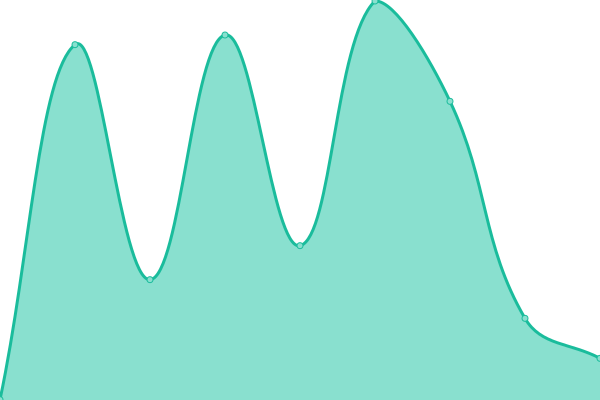

# [📈 Live Status](https://status.umarhadi.dev): <!--live status--> **🟧 Partial outage**

This repository contains the open-source uptime monitor and status page for [umarhadi](https://umarhadi.dev), powered by [Upptime](https://github.com/upptime/upptime).

With [Upptime](https://upptime.js.org), you can get your own unlimited and free uptime monitor and status page, powered entirely by a GitHub repository. We use [Issues](https://github.com/umarhadi/upptime/issues) as incident reports, [Actions](https://github.com/umarhadi/upptime/actions) as uptime monitors, and [Pages](https://status.umarhadi.dev) for the status page.

<!--start: status pages-->
<!-- This summary is generated by Upptime (https://github.com/upptime/upptime) -->
<!-- Do not edit this manually, your changes will be overwritten -->
<!-- prettier-ignore -->
| URL | Status | History | Response Time | Uptime |
| --- | ------ | ------- | ------------- | ------ |
|  [umarhadi.dev](https://umarhadi.dev) | 🟩 Up | [umarhadi-dev.yml](https://github.com/umarhadi/upptime/commits/HEAD/history/umarhadi-dev.yml) | 

 545ms
     
 | 

<a href="https://status.umarhadi.dev/history/umarhadi-dev">100.00%</a>
    

|  [Mastodon](https://kawakawa.fun) | 🟥 Down | [mastodon.yml](https://github.com/umarhadi/upptime/commits/HEAD/history/mastodon.yml) | 

 0ms
     
 | 

<a href="https://status.umarhadi.dev/history/mastodon">0.00%</a>
    

|  [Pixelfed](https://pixelfed.kawakawa.fun) | 🟥 Down | [pixelfed.yml](https://github.com/umarhadi/upptime/commits/HEAD/history/pixelfed.yml) | 

 0ms
     
 | 

<a href="https://status.umarhadi.dev/history/pixelfed">0.00%</a>
    

|  Home Server | 🟥 Down | [home-server.yml](https://github.com/umarhadi/upptime/commits/HEAD/history/home-server.yml) | 

 0ms
     
 | 

<a href="https://status.umarhadi.dev/history/home-server">0.00%</a>
    

|  Jellyfin | 🟥 Down | [jellyfin.yml](https://github.com/umarhadi/upptime/commits/HEAD/history/jellyfin.yml) | 

 0ms
     
 | 

<a href="https://status.umarhadi.dev/history/jellyfin">0.00%</a>
    

<!--end: status pages-->

[**Visit our status website →**](https://status.umarhadi.dev)

## 📄 License

- Powered by: [Upptime](https://github.com/upptime/upptime)
- Code: [MIT](./LICENSE) © [Anand Chowdhary](https://anandchowdhary.com), supported by [Pabio](https://pabio.com)
- Data in the `./history` directory: [Open Database License](https://opendatacommons.org/licenses/odbl/1-0/)
